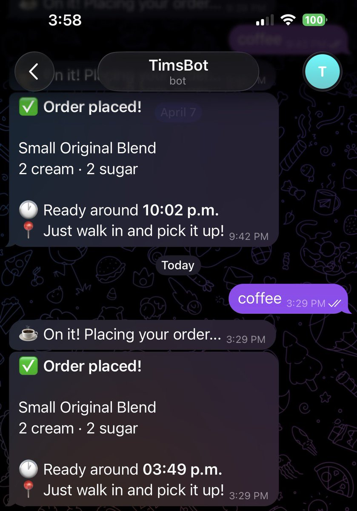
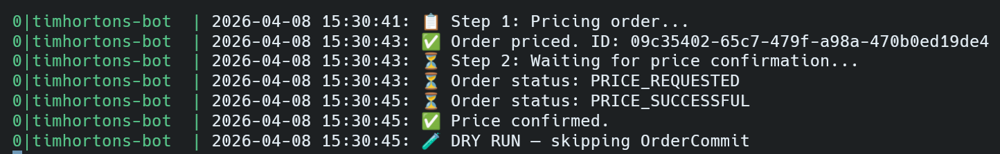

# Tim Hortons Bot

Automate your Tim Hortons mobile order via Telegram. Send "coffee" and your order is placed before you walk in.

> Built by reverse engineering the Tim Hortons app GraphQL API with mitmproxy.

## Preview

| Telegram | PM2 Logs |
|---|---|
|  |  |

## How it works

1. Send "coffee" on Telegram
2. Bot calls the Tim Hortons GraphQL API directly
3. Order is placed and confirmed
4. Walk in and pick it up

## Features

- Auto-refreshes Cognito tokens using a long-lived refresh token — no manual token updates
- Runs permanently via PM2
- Only responds to a single authorized Telegram user ID
- Dry-run mode for testing without placing real orders
- Supports multiple accounts — run a separate instance per person

## Setup

### 1. Clone and install

```bash
git clone https://github.com/ishan-sa/timhortons-bot
cd timhortons-bot
npm install
```

### 2. Create a Telegram bot

1. Message [@BotFather](https://t.me/botfather) on Telegram
2. Send `/newbot` and follow the steps
3. Copy the bot token

### 3. Get your Telegram user ID

Message [@userinfobot](https://t.me/userinfobot) — it'll reply with your user ID.

### 4. Capture your Tim Hortons credentials via mitmproxy

You need to intercept your Tim Hortons app traffic once to grab your refresh token and payment details.

#### Install mitmproxy

```bash
# macOS
brew install mitmproxy

# Linux
pip install mitmproxy
# or: sudo apt install mitmproxy
```

#### Option A: Same WiFi (Mac / Linux on WiFi)

```bash
mitmweb --listen-port 8080
```

Set your phone's proxy to your machine's local IP on port 8080.

#### Option B: Linux on ethernet

Create a WiFi hotspot so your phone connects directly through your machine:

```bash
nmcli device wifi hotspot ifname wlan0 ssid "capture" password "capture123"
mitmweb --listen-port 8080
```

Set your phone's proxy to `10.42.0.1:8080`.

#### Install the mitmproxy cert on your phone

Visit `http://mitm.it` on your phone (with proxy active) and install the cert.

On iOS, also go to **Settings → General → About → Certificate Trust Settings** and enable mitmproxy.

#### Capture the data

Open the Tim Hortons app and browse around. In mitmweb, look for:

- **Refresh token**: POST to `cognito-idp.us-east-1.amazonaws.com` → request body → `AuthParameters.REFRESH_TOKEN`
- **Payment account ID**: any order-related request → `paymentAccountId` field
- **Restaurant ID**: any order-related request → `restaurantId` field

### 5. Configure your env file

```bash
cp .env.example .env.account1
```

Fill in:

| Variable | Description |
|---|---|
| `TELEGRAM_BOT_TOKEN` | From BotFather |
| `ALLOWED_TELEGRAM_USER_ID` | Your Telegram user ID |
| `TH_REFRESH_TOKEN` | Cognito refresh token from mitmproxy |
| `TH_RESTAURANT_ID` | Your Tim Hortons location ID |
| `TH_PAYMENT_ACCOUNT_ID` | Your saved payment method ID |
| `TH_FIRE_IN_MINUTES` | When to start making it (0, 10, or 20) |
| `DRY_RUN` | `true` runs the full flow but skips the final order commit — bot replies confirming it's a dry run |

### 6. Run

```bash
# Test first (DRY_RUN=true in your env file)
npm start

# Run permanently with PM2
npm install -g pm2
pm2 start ecosystem.config.cjs
pm2 startup   # copy-paste the command it prints, then run it
pm2 save      # saves process list so it survives reboots
```

#### PM2 cheat sheet

```bash
pm2 status                             # see all running instances
pm2 logs timhortons-account1           # live logs for an instance
pm2 restart timhortons-account1        # restart (e.g. after editing env file)
pm2 stop timhortons-account1           # stop
pm2 start timhortons-account1          # start again
```

## Multiple accounts

You can run as many instances as you want — one per person. For each account:

1. Copy the example env file with a unique name:
   ```bash
   cp .env.example .env.account2
   ```
2. Fill it in with that person's credentials (their own TH refresh token, payment ID, restaurant ID, Telegram bot token, and user ID)
3. Add a new entry in `ecosystem.config.cjs`:
   ```js
   {
     name: "timhortons-account2",
     script: "npx",
     args: "tsx index.ts",
     cwd: __dirname,
     interpreter: "none",
     watch: false,
     restart_delay: 5000,
     max_restarts: 10,
     env_file: ".env.account2",
     log_date_format: "YYYY-MM-DD HH:mm:ss",
   }
   ```
4. Start it:
   ```bash
   pm2 start ecosystem.config.cjs
   pm2 save
   ```

Each instance runs completely independently with its own credentials and Telegram bot.

## Token refresh

The bot automatically refreshes the Cognito ID token every 55 minutes using your `TH_REFRESH_TOKEN` — no manual intervention needed for day-to-day use.

The refresh token itself is long-lived but can expire in these situations:

- You log out of the Tim Hortons app
- You sign in on a new device and the old session gets invalidated
- The token goes unused for ~30 days (Cognito inactivity timeout)

If the bot stops working and `pm2 logs timhortons-account1` shows a Cognito auth error, just redo the mitmproxy capture to grab a fresh refresh token, update `TH_REFRESH_TOKEN` in the relevant env file, then `pm2 restart timhortons-account1`.

## Customizing your order

Edit `api.ts` to change the order:

- `productVariantId` — the item ID
- `selectedModifiers` — cream, sugar, size, etc.
- `price.cents` — price in cents CAD

All IDs were captured from the Tim Hortons app API via mitmproxy.

## Trigger phrases

Send any of these to the bot on Telegram:

- `coffee`
- `order my coffee`
- `tims`
- `order`
- ☕

## Disclaimer

- **Not affiliated with or endorsed by Tim Hortons or Restaurant Brands International.**
- This project uses undocumented, private APIs reverse engineered from the Tim Hortons mobile app for **personal use only**. It is not intended for commercial use, resale, or bulk automation.
- These APIs are unofficial and undocumented. **Tim Hortons may change, break, or block them at any time without notice**, which may cause the bot to stop working with no fix available.
- By using this project you are responsible for ensuring your usage complies with Tim Hortons' Terms of Service and the laws of your jurisdiction.
- The authors of this project take no responsibility for account bans, order errors, charges, or any other consequences arising from its use.
- **Use at your own risk.**
